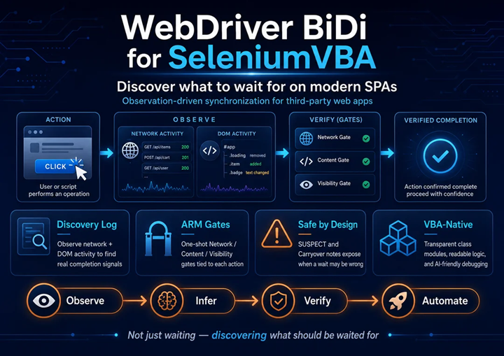
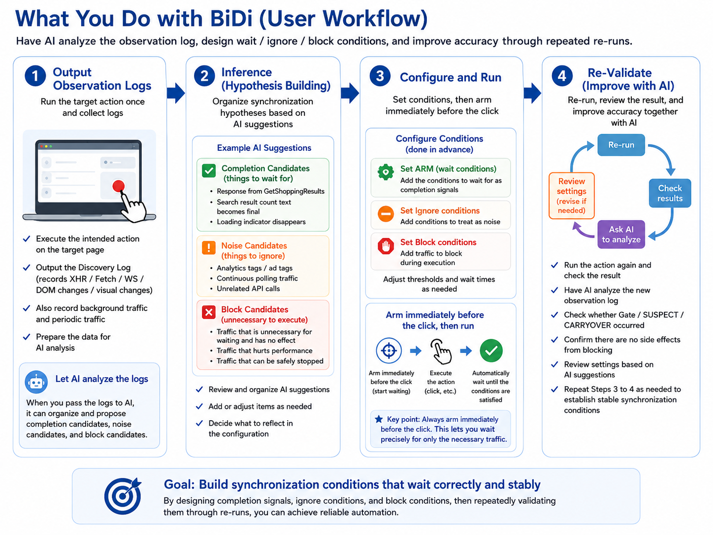

# WebDriver BiDi for SeleniumVBA v3.1

This project is a WebDriver BiDi extension for **[SeleniumVBA](https://github.com/GCuser99/SeleniumVBA)** by @GCuser99.

It is not intended to replace SeleniumVBA, Playwright, Puppeteer, or Selenium itself.  
Instead, it focuses on extending SeleniumVBA with WebDriver BiDi capabilities, especially for modern third-party SPA sites where no explicit completion signal is available.

Modern SPAs such as React, Vue.js, and enterprise web applications often update the DOM asynchronously after network responses have completed. This makes traditional VBA automation fragile, because "request completed" does not always mean "page is ready."

To address this, the tool observes network activity, Fetch/XHR activity, DOM mutations, and quiet windows to infer when the page has become stable enough for the next automation step.

Since this project assumes concurrent use of classic SeleniumVBA methods and BiDi-based observation, the BiDi API surface is intentionally kept minimal.

## Discovery Log

The Discovery Log is designed for third-party SPA sites where the automation code cannot access an internal “ready” or “completed” flag.

It records network responses, DOM mutation bursts, suppressed background noise, and stability margins such as slackMs.

This makes it easier to determine which requests should be tracked, which requests should be ignored, which resources may be safely blocked, and whether the current wait thresholds are appropriate for the target site.

The structured log can also be provided to an AI assistant for analysis. By examining the sequence and timing of network activity, DOM updates, and stability decisions, the AI can help identify likely completion signals, recommend suitable network or content signals to arm, suggest noise-filtering or resource-blocking rules, and propose adjustments to the wait strategy.

In other words, the Discovery Log is not just an execution log.
It is a diagnostic tool for discovering what should be waited for—and for helping AI devise practical synchronization solutions—when automating unknown third-party SPAs.

## Validation Benchmark

For validation, this project uses a challenging benchmark: entering text into the ServiceNow login form.

ServiceNow is frequently regarded as one of the more difficult Single Page Applications to automate due to its complex SPA behavior, Shadow DOM usage, and asynchronous UI updates.

The validation code is contained in the `Main07` procedure.

## VirusTotal Scan Results

WebDriver BiDi for SeleniumVBA v3.0 was scanned by VirusTotal on July 22, 2026, and received 0 detections from 64 security vendors at the time of testing.

---
## [Supported OS]
* **Windows11**
## [Supported Application]
* **Excel / Access**
## [Supported Browsers]
* **Edge / Chrome**
* *Firefox is not supported due to functional limitations.*

## Installation

Setup and import instructions are available in the **[Wiki](https://github.com/hanamichi77777/WebDriver-BiDi-for-SeleniumVBA/wiki)**.

## Scope and Limitations

* **SPA completion is inferred, not guaranteed.** The default idle consensus is based on observed network activity, Fetch/XHR counters, DOM mutations, and a quiet window. It cannot prove the target application's internal logical completion or rule out future delayed work.
* **Use explicit completion signals for important actions.** When a specific DOM rewrite or network response marks completion, arm `ArmContentSignal` and/or `ArmNetworkSignal` immediately before the action. A targeted signal is safer than relying on quietness alone.
* **This project is not intended for large-scale parallel browser execution.** It is optimized for precise control and observation of one browser, or a small number of sessions, rather than dozens or hundreds of concurrent browsers.
* **Idle-ignore patterns require careful selection.** An overly broad `AddIdleIgnoreNetworkPattern` rule can exclude meaningful requests and cause an early `STABLE` result.

---

## 📂 Procedure Overview (Sample Module: `BiDi_Sample`)

These descriptions are aligned with the `BiDi_Sample` module included in WebDriver BiDi for SeleniumVBA v2.7. The procedures are learning and diagnostic examples rather than permanent integration tests for the referenced public websites. Third-party URLs, XPath expressions, ARIA labels, extension folders, and observed network endpoints can change without notice. When adapting a sample, first identify the application's real completion condition, then update selectors, signal patterns, noise rules, and business-level verification accordingly.

### 1. Main01: Google Translate Extension Installation through WebDriver BiDi
This procedure is intentionally limited to one task: installing the unpacked Google Translate extension into the current Chrome automation session.

* **Runtime installation instead of startup injection:** Calls `ExecuteWebExtensionInstall`, which sends the W3C `webExtension.install` command after Chrome has started. The extension itself is not passed through `caps.AddExtensions` or `--load-extension`.
* **Why classic capabilities are not used:** Branded Chrome removed the `--load-extension` flag in Chrome 137. Therefore, the traditional startup-capability approach commonly shown in older Selenium examples is not a dependable route for this unpacked-extension scenario in current normal Chrome.
* **Required browser configuration:** The sample enables BiDi and launches Chrome with `--remote-debugging-pipe` and `--enable-unsafe-extension-debugging` before connecting `BiDiCommandWrapper`.
* **Local source-path requirement:** `extensionPath` must identify the Google Translate version directory containing `manifest.json`. The version folder can change whenever Chrome updates the extension.
* **Easy diagnosis:** No navigation or SPA wait is performed. Failures are therefore normally attributable to the local path, the manifest, Chrome/ChromeDriver support, startup arguments, or enterprise browser policy rather than synchronization logic.
* **Result handling:** The raw BiDi response is written to the Immediate window. Because installation changes browser state, an ambiguous transport failure is not automatically retried.

See [Installing Chrome Extensions through WebDriver BiDi](#installing-chrome-extensions-through-webdriver-bidi) for the complete background and prerequisites.

### 2. Main02: Lazy-Load Scrolling with Best-Effort SPA Quiescence
This procedure demonstrates controlled scrolling on a page that appends content as the user moves downward.

* **Triggering lazy-loaded content:** `ExecuteLazyLoadScroll` repeatedly scrolls the page to provoke additional loading.
* **Practical completion assessment:** After scrolling, the wrapper evaluates observed Fetch/XHR activity, DOM mutations, and the stable window. This is a best-effort quiescence assessment; it does not prove that an infinite feed has been exhausted or that no future delayed work will occur.
* **Business-level verification:** After the wait, SeleniumVBA takes a DOM snapshot and counts article links. The count is useful as a manual verification result, not as a fixed expected value for the live site.
* **What to customize:** Replace the URL and final article XPath. If the site uses a dedicated “load more” response or a stable result container, consider arming an explicit network or content signal instead of relying on quietness alone.

### 3. Main03: Two-Stage Route Search, Resource Filtering, and Discovery Log
This procedure automates a live route-search workflow that requires two sequential button clicks across a page transition, while recording evidence that can be used to tune SPA synchronization.

* **Two different traffic controls:** `ExecuteEnableResourceBlocking` prevents matching requests from being sent, while `AddIdleIgnoreNetworkPattern` allows requests to continue but excludes matching background traffic from idle judgment. Blocking is stronger and can change page behavior; ignoring is appropriate for required but continuously noisy telemetry.
* **Focused diagnostic recording:** `StartDiscoveryLog` begins after the initial navigation and covers field input, the first search-button action, the resulting page transition, the second search-button action, responses, DOM mutations, and the final stability decision.
* **Action waits remain enabled:** The input and click operations keep their normal post-action waits because route fields, the intermediate transition, and final submission may trigger asynchronous work.
* **Intentional two-stage button sequence:** The prefix selector clicks the first button. That action changes the page, after which another button with the exact ID appears and is clicked by the second call. These calls are not duplicate submissions against one unchanged element. When adapting the sample, verify that each selector belongs to the intended page state before removing either action.
* **How to diagnose failure:** Inspect the Discovery Log before adding fixed delays. Determine whether the problem is an incorrect selector, a transition that did not complete, relevant traffic excluded as noise, an untracked completion response, or a render that occurs after apparent network quiet.

### 4. Main04: Manual Login Wait Using URL and Post-Navigation Activity
This procedure opens a login page, lets the user authenticate manually, and waits for the browser to reach the expected authenticated URL.

* **No arbitrary `Sleep`:** `ExecuteIsUrlContains` repeatedly checks the current live URL while the wait engine also observes navigation and network activity until a match or timeout occurs.
* **Idle-aware success condition:** The sample uses `waitNetworkIdle=True`, so a matching URL alone is not treated as sufficient; the configured post-navigation activity must also reach the wrapper's wait conclusion.
* **Manual credentials by design:** Credentials are not automated. The user must submit the login form within the configured 30-second window.
* **What to customize:** Replace the login URL, expected URL fragment, and timeout. If an identity provider keeps the same URL after authentication, use a stable authenticated DOM/content signal instead of URL matching.

### 5. Main05: Choosing Whether an Action Needs a Post-Action Wait
This procedure demonstrates that not every browser action needs the same synchronization policy.

* **Known synchronous actions:** Text entry and a color-button click use `waitForCompletion=False` on the Selenium test page because those specific actions are not expected to start relevant asynchronous work.
* **Asynchronous action retained:** The “Add Label” click keeps the normal wait and requests a 1000 ms stable window because it triggers a delayed DOM update.
* **One-shot verification:** `Debug.Assert` checks that the resulting element contains `Done!` after the action wait. This is a business-level assertion, not another polling loop.
* **Adaptation rule:** Disable the post-action wait only when the target application's behavior is known. Using `False` merely to increase speed can reintroduce race conditions.

### 6. Main06: Iframe Browsing-Context Discovery without Selenium Frame Switching
This procedure targets an element inside an iframe by passing a WebDriver BiDi browsing-context ID directly to the action.

* **Context discovery by URL:** `GetIframeContextIdByUrl` searches the current context tree for a child frame whose live URL contains the supplied fragment.
* **Explicit action scope:** The returned context ID is passed to `ExecuteClickByXPath`, so the lookup and click run in that frame without changing SeleniumVBA's active frame.
* **What to customize:** Replace the top-level URL, iframe URL fragment, and in-frame XPath.
* **How to diagnose failure:** Check the frame's actual post-navigation URL and hierarchy. Redirects, dynamically generated URLs, and additional nesting can make an old fragment stop matching.

### 7. Main07: Consent Auto-Clicker, Shadow DOM, and Explicit Network Gate
This procedure is the ServiceNow validation scenario and combines several features needed for a difficult third-party SPA.

* **Pre-navigation auto-clicker:** `ExecuteRegisterAutoClickerByXPath` is registered before navigation so the browser-side helper can dismiss the consent banner as soon as it appears.
* **Shadow DOM interaction:** `ExecuteShadowClick` targets the sign-in button inside an encapsulated web component.
* **Arm-then-act network gate:** `ArmNetworkSignal "metadata/application"` is called immediately before the Shadow DOM click. The one-shot signal belongs to the next action wait and helps bridge the transition into the sign-in experience.
* **End-to-end diagnostic log:** Recording starts before registration and navigation, allowing the log to preserve the consent action, navigation, armed response, mutation tail, and final username input.
* **Site-specific details:** The consent XPath, shadow selector, username XPath, and network pattern are observations from the current ServiceNow implementation, not universal authentication signals.

### 8. Main08: Google Flights Heavy SPA Stress Sample
This procedure demonstrates how multiple synchronization techniques can be combined on a highly reactive live SPA.

* **Selector resilience:** The sample favors ARIA roles and accessible labels over obfuscated CSS classes, sets `--lang=en`, and uses `[last()]` where Google may create or replace duplicate combobox inputs.
* **Trusted input path:** `ExecuteInputValueByXPath` uses the wrapper's active-element-aware input flow to clear, type, and validate values while the framework may replace controls.
* **Traffic classification:** Non-essential resources are blocked, while required background requests are merely ignored for idle judgment. The Discovery Log remains the evidence source for revising both lists.
* **Suggestion-selection gates:** Immediately before clicking the Sapporo suggestion, the sample arms `rpcids=tDoGIe`; immediately before clicking the Paris suggestion, it arms `rpcids=BVAT3`. Each click also requests a 1000 ms stable window. These signals were discovered from the current live workflow and may change independently.
* **Calendar and result gates:** Before opening the departure calendar, the sample arms the `GetCalendarPicker` network signal and the visibility signal `//div[@data-gs]`. Before pressing Search, it arms `GetShoppingResults`. All `Arm*` signals are one-shot observations rather than stable public APIs.
* **Live-site limitations:** City suggestions, date-cell positions, button labels, endpoint names, consent state, locale, and account state may change. Update selectors and signals from a fresh log instead of adding arbitrary delays.
* **Expected outcome:** The example demonstrates a robust diagnostic strategy, but it cannot guarantee immunity from future Google UI or backend changes.

### 9. Main09: Manual Discovery Log Recorder
This procedure records a narrow observation window while the user performs one meaningful browser action manually.

* **Focused recording:** The recommended pattern is one action per run—for example, opening a calendar, selecting a suggestion, or pressing Search—so the causal sequence is easier to interpret.
* **What the log captures:** It records the BiDi/network and SPA-probe evidence used by this project, including requests/responses, DOM activity, suppressed noise, armed-signal events, and stability decisions. It should not be described as a dump of every possible browser event.
* **Filtering is not blocking:** `excludeImagesAndCss=True` removes common image/CSS entries from the saved diagnostic stream; it does not prevent those resources from loading in the page.
* **Time-window selection:** A longer recording is not always better. Extra background activity can obscure the request and mutation tail associated with the intended action.
* **How to use the result:** Use `discovery_log.txt` to decide what should be blocked, ignored, armed, or verified. Do not choose a completion signal from its name alone; confirm its timing and relation to the resulting DOM change.

### 10. Main10: Content-Signal Gate for the Settle-to-Render Gap
This procedure demonstrates `ArmContentSignal` for cases where a response settles before an existing results container is rewritten.

* **Arm-then-act pattern:** The sample arms the existing target `//*[@id='table-body']` immediately before each year click. The next relevant SPA wait is gated on observing that subtree change in addition to the normal idle conditions.
* **Existing-target requirement:** The target XPath must already exist when armed. This signal is not appropriate for an element that is created only after the action; choose an existing parent container or another completion signal instead.
* **One-shot consumption:** Each armed signal is consumed by the next relevant wait, so the sample must re-arm before the second year click.
* **Fail-fast configuration:** A missing target at arm time raises immediately, exposing a mistyped or obsolete XPath instead of silently creating a meaningless wait.
* **Noise filtering:** Known background telemetry is ignored for idle judgment so unrelated traffic does not prevent the content-gated wait from settling.
* **What to customize:** Choose a stable existing subtree whose rewrite genuinely marks business completion. Avoid broad ancestors that also mutate for animations, clocks, advertisements, or unrelated telemetry.
---
